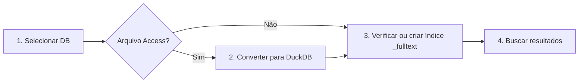

# Cookbook de Uso — Busca DuckDB

Guia passo a passo para instalar, rodar e usar o painel local de busca, rastreio de registros e comparação de bancos.

---

## Visão geral do fluxo

Fluxo geral de uso da aplicação:

1. **Obter o código**: clonar o repositório ou baixar o ZIP do GitHub.  
2. **Criar ambiente virtual**: `python -m venv .venv`.  
3. **Instalar dependências**: `pip install -r requirements.txt`.  
4. **Iniciar o servidor Flask**: `python main.py`.  
5. **Acessar no navegador**: abrir `http://127.0.0.1:5000/`.  
6. **Usar as abas principais**: **Busca**, **Rastrear registro** e **Comparar bancos** conforme a necessidade.

Fluxo da aba **Busca**:



---

## 1. Pré‑requisitos

- **Sistema operacional:** Windows 10/11 (Linux/macOS também funciona com pequenos ajustes).
- **Ferramentas básicas:**  
  - Git instalado (para clonar o repositório).  
  - Python 3.10 ou superior instalado e no `PATH`.  
  - Navegador moderno (Chrome, Edge ou Firefox).
- **Opcional (recomendado):**  
  - VS Code para editar/ver arquivos.  
  - Stack/driver de Access se você for trabalhar com `.mdb`/`.accdb`.

---

## 2. Obter o código

### 2.1. Clonar com Git

Abra o **PowerShell** e rode:

```powershell
cd C:\
git clone https://github.com/allysonalmeidaa/mdb2sql_fork.git
cd mdb2sql_fork
```

Esse é o repositório oficial do projeto no GitHub.

### 2.2. Baixar ZIP (alternativa)

1. Acesse o repositório no GitHub.
2. Clique em **Code → Download ZIP**.
3. Extraia o ZIP (por exemplo em `C:\mdb2sql_fork`).
4. Abra um PowerShell dentro dessa pasta.

---

## 3. Criar ambiente virtual e instalar dependências

No PowerShell, já dentro da pasta do projeto:

```powershell
# criar ambiente virtual
python -m venv .venv

# ativar o ambiente virtual
.\.venv\Scripts\Activate.ps1

# atualizar o pip (opcional, recomendado)
pip install --upgrade pip

# instalar dependências do projeto
pip install -r requirements.txt
```
---

## 4. Iniciar o servidor local

Ainda no PowerShell, com o ambiente virtual ativo e na pasta do projeto:

```powershell
python main.py
```

Ou, se preferir apontar direto para o app Flask (modo avançado):

```powershell
python interface/app_flask_local_search.py
```

Em ambos os casos, você deve ver algo parecido com:

```text
* Running on http://127.0.0.1:5000
```

> **Importante:** deixe essa janela/terminal aberta. Se fechá‑la, o servidor para.

Agora, abra o navegador e acesse:

- `http://127.0.0.1:5000/` → aba **Busca** (padrão).  
- `http://127.0.0.1:5000/track_record` → aba **Rastrear registro**.  
- `http://127.0.0.1:5000/compare_dbs` → aba **Comparar bancos**.

Se quiser forçar atualização da interface após mudanças, use **Ctrl+F5** no navegador.

---

## 5. Usando a aba "Busca"

A aba **Busca** é o painel principal para pesquisar em bancos DuckDB (nativos ou convertidos a partir de Access).

### 5.1. Entendendo a tela

Partes principais da interface:

- **Topo (badges e botões):**  
  - `DB:` nome do banco ativo.  
  - `Modo:` DuckDB nativo ou Access convertido.  
  - `Status:` situação do índice `_fulltext`.  
  - `Alertas:` resumo de alertas críticos/avisos.  
  - Botões: **Detalhes**, **Selecionar DB**, **Prioridade**, **Indice _fulltext**, **Arquivos**, **Atualizar**.
- **Cartões de status:**  
  - **DB ativo**, **Conversão**, **Indice _fulltext**, **Busca**.
- **Fluxo atual (steps 1–4):**  
  - 1. Selecionar DB  
  - 2. Converter ou validar  
  - 3. Indexar `_fulltext`  
  - 4. Buscar resultados
- **Gestão de arquivos (painel Arquivos):**  
  - Mostra arquivos enviados, com nome, tamanho, data, status, e ações (Salvar/Excluir).
- **Área de resultados:**  
  - Tabelas com resultados da busca, prioridade, exportação CSV etc.

### 5.2. Passo 1 – Selecionar ou enviar um DB

1. Clique em **Selecionar DB** (botão no topo) ou no passo **1. Selecionar DB** do fluxo.  
2. No modal que abre:
   - Para trabalhar direto com DuckDB, use arquivos `.duckdb`, `.db`, `.sqlite`, `.sqlite3`.
   - Para trabalhar com Access, use `.mdb`/`.accdb` (serão convertidos para `.duckdb`).
3. Em **Enviar arquivo**:
   - Clique em **Escolher arquivo** (campo de upload).  
   - Selecione o arquivo desejado.  
   - Clique em **Enviar**.
4. Em **Ou selecione um DB já enviado**:
   - Aparecem todos os uploads anteriores.  
   - Clique em **Selecionar** no banco desejado.

> Dica: a barra lateral esquerda também mostra **abas por banco** para trocar rapidamente as tabelas exibidas.

### 5.3. Passo 2 – Conversão (quando o arquivo é Access)

Se você subiu um `.mdb` ou `.accdb`:

- O card de **Conversão** passará para **Convertendo**.  
- No modal de seleção de DB, aparece uma barra de progresso com:
  - porcentagem;  
  - tabela atual;  
  - texto indicando o estado da conversão.

Aguarde até a conversão terminar. O card de **Conversão** ficará como **Concluída** e o modo será **Access convertido**.

### 5.4. Passo 3 – Índice `_fulltext`

O índice `_fulltext` é necessário para que a busca funcione bem em DuckDB.

1. Clique em **Indice _fulltext** (topo) ou no passo **3. Indexar _fulltext**.  
2. No modal de índice:
   - `Recriar _fulltext`: apaga e recria o índice.  
   - `Chunk` e `Batch`: controlam o tamanho dos blocos de leitura/inserção (valores padrão já funcionam bem).  
3. Clique em **Iniciar indexação**.

Enquanto a indexação estiver rodando:

- O badge de status indica **Indexando...**.  
- O step 3 fica em destaque de processamento.  
- A própria interface bloqueia a busca, mostrando banners como **"Indexacao em andamento. Busca liberada ao terminar."**.

Quando terminar:

- O card **Indice _fulltext** mostra **Pronto** e a quantidade de linhas indexadas.  
- O step 4 fica marcado como pronto para buscar.

### 5.5. Passo 4 – Buscar resultados

1. Clique em **Ir** no passo **4. Buscar resultados** ou no botão correspondente.  
2. No modal de busca:
   - Campo **Termo**: digite o que quer pesquisar (ex.: `svp`).  
   - **Tabelas**: selecione as tabelas desejadas ou deixe o padrão.  
   - **Opções avançadas**: ajuste `score mínimo`, `limites por tabela`, `tokenização` etc., se necessário.
3. Clique em **Pesquisar**.

A interface:

- Mostra a tabela de resultados com colunas, valores e destaques.  
- Permite ordenar, filtrar e navegar entre páginas.  
- Oferece o botão **Exportar resultados CSV** para baixar todos os resultados exibidos.

> Enquanto a conversão ou a indexação estiverem ativas, a busca fica bloqueada e a UI alerta o motivo (conversão em andamento, índice ausente, etc.).

---

## 6. Painel "Arquivos"

O painel **Arquivos** serve para gerenciar os arquivos enviados para o servidor.

1. Clique em **Arquivos** no topo da tela.  
2. O cartão **Gestão de arquivos** aparece logo abaixo do bloco "Fluxo atual".

Neste painel você pode:

- Ver a lista de arquivos (nome, tamanho, data, tipo, status).  
- Ordenar por nome ou data (mais recente/antiga).  
- Clicar em **Salvar** para baixar uma cópia do arquivo.  
- Clicar em **Excluir** para removê‑lo do servidor.

A seleção de DB na aba **Busca** usa exatamente essa lista como base.

---

## 7. Aba "Rastrear registro"

A aba **Rastrear registro** permite procurar um registro específico em vários bancos/diretórios pré‑configurados.

Passos típicos:

1. Acesse `http://127.0.0.1:5000/track_record` ou clique na aba **Rastrear registro**.  
2. Escolha o diretório ou grupo de bancos onde deseja procurar (por exemplo, bancos atuais, históricos, uploads `.duckdb`).  
3. Informe os valores das chaves que identificam o registro (ex.: código, CPF, etc.).  
4. Inicie a busca.

A interface retorna:

- Em quais bancos o registro foi encontrado.  
- Dados detalhados por ocorrência.

---

## 8. Aba "Comparar bancos"

A aba **Comparar bancos** compara duas bases DuckDB, destacando registros:

- alterados;  
- novos;  
- removidos.

Fluxo simplificado:

1. Acesse `http://127.0.0.1:5000/compare_dbs` ou clique em **Comparar bancos**.  
2. Escolha os **dois bancos DuckDB** a serem comparados.  
3. Selecione tabela(s), chaves e filtros.  
4. Rode a comparação.

O painel mostra:

- Diferenças por tipo (alterado, novo, removido).  
- Colunas alteradas por registro.  
- Filtros para focar em subsets de interesse.

---

## 9. Alertas e logs

A interface possui um painel de **Alertas e logs** para facilitar o diagnóstico.

- No topo, o badge **Alertas** indica:
  - `-` quando não há nada relevante.  
  - `n críticos` quando há erros importantes (por exemplo, arquivo `.duckdb` travado por outro processo).  
- Clique em **Detalhes** ou no próprio badge para abrir o modal de alertas.

No modal, você vê:

- **Críticos:** erros graves (I/O, exceptions, falhas de status).  
- **Avisos:** problemas não críticos, mas importantes.  
- **Infos:** mensagens informativas.  
- **Logs recentes:** eventos do servidor e da UI, em ordem cronológica.

Se você abrir um `.duckdb` em outro programa (por exemplo, DBeaver) e a API não conseguir lê‑lo, isso aparecerá como alerta crítico (erro de I/O). Feche o outro programa, atualize com **Atualizar** na barra superior e selecione o banco novamente.

---

## 10. Como gerar o PDF deste cookbook

Este arquivo está em `docs/cookbook_busca_duckdb.md`.

Você pode gerar um PDF de várias formas:

- **VS Code + extensão de Markdown:**  
  - Abra o arquivo no VS Code.  
  - Use o comando da extensão (ex.: "Markdown PDF" → `Markdown PDF: Export (pdf)`).
- **Ferramenta de linha de comando (ex.: pandoc):**  
  - Instale o pandoc.  
  - Rode:  
    ```powershell
    pandoc docs/cookbook_busca_duckdb.md -o docs/cookbook_busca_duckdb.pdf
    ```

Assim, você obtém um PDF pronto para distribuir para usuários finais, mantendo este Markdown como fonte única de verdade.
